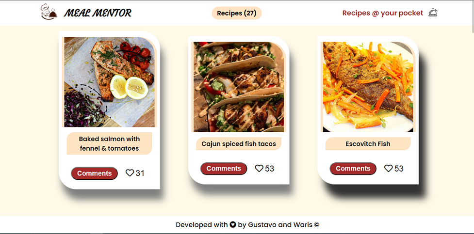

   

# JavaScript group capstone: Meal Mentor



## Built With

- **HTML**
- **CSS**
- **JavaScript**
- **GitHub flow**
- **Linters**
- **Webpack**
- **Jest**

[Live Demo Link (if available)](https://iamwaris97.github.io/Delicious-Meals/dist/)

[Video of developers describing the project](https://drive.google.com/file/d/1FQ4QcZHNoPSAWWaeBLWg4hwFL-93Ic8U/view?usp=sharing)

## Getting Started

### Steps to run the project

#### 1 - Git Clone.

```
git clone https://github.com/iAmWaris97/Delicious-Meals.git
```
#### 2 - Install npm.

```
npm install
```

#### 3 - run the project

```
npm start
```

## Authors 
### 👤 Waris
- GitHub: [@iAmWaris97](https://github.com/iAmWaris97)
- Twitter: [@iAmWaris97](https://twitter.com/iAmWaris97)
- LinkedIn: [Waris Haleem](https://www.linkedin.com/in/waris-haleem/)

### 👤 Gustavo
- GitHub: [@MarcoAurelioAntonio](https://github.com/MarcoAurelioAntonio)
- Twitter: [@gustavoporcilio](https://twitter.com/gustavoporcilio)
- LinkedIn: [Gustavo Porcilio](https://www.linkedin.com/in/gustavo-ariel-porcilio/)

## 🤝 Contributing

Contributions, issues, and feature requests are welcome!

Feel free to check the [issues page](../../issues/).

## Show your support

Please give a ⭐️ if you like this project!

## 📝 License
- This project is [MIT](./LICENSE) licensed.
